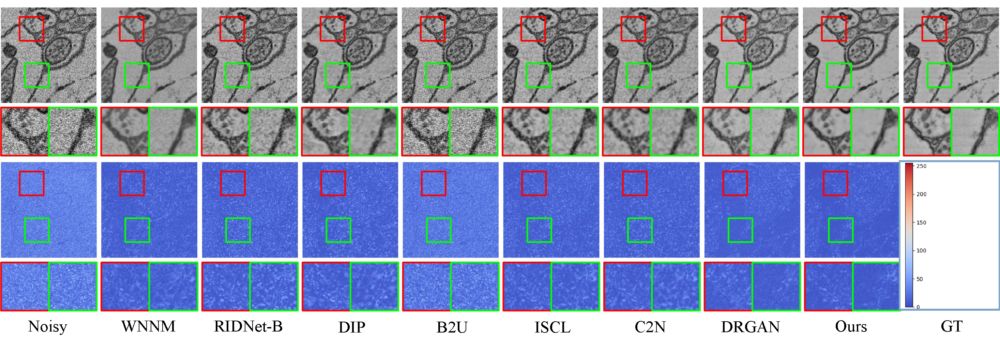

# Unsupervised Domain Adaptation for EM Image Denoising with Invertible Networks

Shiyu Deng, Yinda Chen, Wei Huang, Ruobing Zhang, and Zhiwei Xiong(*)

*Corresponding Author

University of Science and Technology of China (USTC)


## Introduction

This repository is the **official implementation** of the paper, "Unsupervised Domain Adaptation for EM Image Denoising with Invertible Networks", where more visual results and implementation details are presented.


## Dependencies and Installation

- Python 3 (Recommend to use [Anaconda](https://www.anaconda.com/download/#linux))
- [PyTorch >= 1.0](https://pytorch.org/)
- NVIDIA GPU + [CUDA](https://developer.nvidia.com/cuda-downloads)
- Python packages: `tensorboardX, numpy, etc`

If you have a [Docker](https://www.docker.com/) environment, we strongly recommend you to pull our image as follows,

```
docker pull registry.cn-hangzhou.aliyuncs.com/renwu527/auto-emseg:v5.4
```

or

```
docker pull renwu527/auto-emseg:v5.4
```


## Dataset

RETINA dataset can be downloaded from both [Google Drive](https://drive.google.com/drive/folders/16koZx4Y4ImqExXcG-KZQkIlv2izv9cJJ?usp=sharing) and [Baidu Cloud Drive](https://pan.baidu.com/s/1-gmYIHUL-WtAtxRVxUi0eQ?pwd=USTC).


## Training stage

```python
python main.py --cfg ./config/ours.yml
```


## Testing stage

```python
python test.py --cfg ./config/ours/yml
```


## Visual Results




## Related projects

[C2N](https://github.com/onwn/C2N)

[Invertible-Image-Rescaling](https://github.com/pkuxmq/Invertible-Image-Rescaling)


## Contact

If you have any problem with the released code, please do not hesitate to contact me by email ([sydeng@mail.ustc.edu.cn](mailto:sydeng@mail.ustc.edu.cn)).


## Citation

```
@ARTICLE{10604846,
  author={Deng, Shiyu and Chen, Yinda and Huang, Wei and Zhang, Ruobing and Xiong, Zhiwei},
  journal={IEEE Transactions on Medical Imaging}, 
  title={Unsupervised Domain Adaptation for EM Image Denoising with Invertible Networks}, 
  year={2024},
  volume={},
  number={},
  pages={1-1},
  doi={10.1109/TMI.2024.3431192}}
```